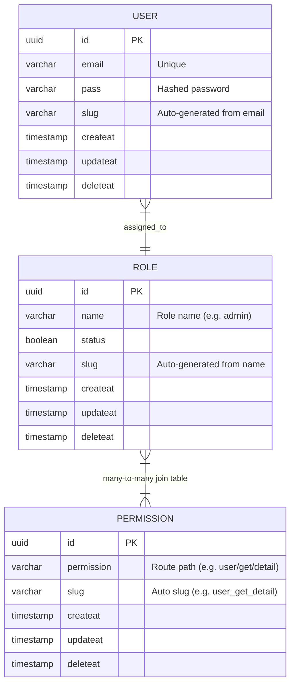
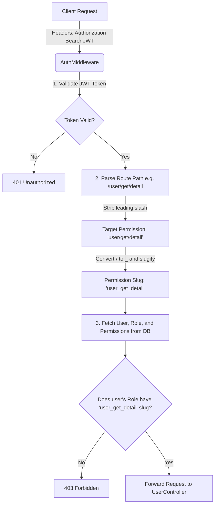

# 🚀 NestJS Role-Based Access Control (RBAC) API

A comprehensive, production-ready NestJS (v11) API designed for **User Management**, **Role-Based Access Control (RBAC)**, and **Dynamic Endpoint Permission Validation**. The application utilizes **TypeORM** for object-relational mapping, **PostgreSQL** for database storage, and **JWT** for secure user authentication.

---

## 📋 Table of Contents
1. [Tech Stack](#-tech-stack)
2. [Database Architecture & Schema](#-database-architecture--schema)
3. [Environment Configuration](#-environment-configuration)
4. [Project Setup & Installation](#-project-setup--installation)
5. [Database Seeding](#-database-seeding)
6. [Authorization Lifecycle & Flow](#-authorization-lifecycle--flow)
7. [API Endpoint Reference](#-api-endpoint-reference)
8. [Step-by-Step Postman Testing Flow](#-step-by-step-postman-testing-flow)

---

## 🛠️ Tech Stack

This project is built using a modern, robust backend tech stack:

*   **Core Framework:** [NestJS (v11.1.19)](https://nestjs.com/) - A progressive Node.js framework for building efficient, reliable, and scalable server-side applications.
*   **Language:** [TypeScript (v5.7.3)](https://www.typescriptlang.org/) - Typed superset of JavaScript.
*   **Database:** [PostgreSQL](https://www.postgresql.org/) - Powerful, open-source object-relational database system.
*   **ORM:** [TypeORM (v0.3.28)](https://typeorm.io/) - Active Record and Data Mapper patterns for SQL database interaction.
*   **Authentication:** [JWT (JSON Web Token)](https://jwt.io/) via `@nestjs/jwt` and `jsonwebtoken`.
*   **Security:** [Bcrypt (v6.0.0)](https://github.com/kelektiv/node.bcrypt.js) - Industry-standard library for hashing passwords securely.
*   **Utilities:** `slugify` (v1.6.9) - For automatically generating clean, URL-safe slugs for users, roles, and permissions.

---

## 🗄️ Database Architecture & Schema

The application features three main tables (entities) managed by TypeORM, with clean relationships to map users to roles, and roles to specific permission keys.



### Entity Fields Detailed

1.  **User (`user` Entity)**
    *   `id`: Primary key (`uuid`).
    *   `email`: User's login email (`unique`, `varchar`).
    *   `pass`: Hashed password using Bcrypt (`varchar`).
    *   `slug`: Automatically generated lowercase slug from email (e.g., `user@example.com` $\rightarrow$ `user-example-com`).
    *   `role`: Many-to-One association with the `role` entity.
    *   `createat` / `updateat` / `deleteat`: Soft-delete timestamps for entity tracking.

2.  **Role (`role` Entity)**
    *   `id`: Primary key (`uuid`).
    *   `name`: Label of the role (e.g., `ADMIN`, `SUPERADMIN`, `USER`).
    *   `status`: Active status of the role (`boolean`).
    *   `slug`: Slug generated from name using `slugify` (e.g., `SUPERADMIN` $\rightarrow$ `superadmin`).
    *   `permissions`: Many-to-Many association with `Permission` via an automatically generated join table.

3.  **Permission (`Permission` Entity)**
    *   `id`: Primary key (`uuid`).
    *   `permission`: The plain-text permission string representing a route (e.g., `user/get/detail`).
    *   `slug`: Automatically generated permission identifier replacing slashes with underscores (e.g., `user/get/detail` $\rightarrow$ `user_get_detail`).

---

## ⚙️ Environment Configuration

Create a `.env` file in the root directory by copying the `.env.example` template:

```bash
cp .env.example .env
```

Define the configuration keys below:

```env
PORT=3000
DB_HOST=localhost
DB_PORT=5432
DB_USER=postgres
DB_PASS=your_postgres_password
DB_NAME=fullapp
DB_SYNC=true
```

> [!NOTE]
> `DB_SYNC=true` executes TypeORM's database schema sync on application start. Set to `false` in production environments to avoid accidental table drops, and use TypeORM migrations instead.
> The JWT Secret is set inside the source code as `abcd` for validation simplicity. For production builds, inject it securely via environment variables.

---

## 💾 Project Setup & Installation

Follow these steps to run the application locally:

### 1. Install Dependencies
```bash
npm install
```

### 2. Prepare Database
Create a PostgreSQL database named `fullapp` (or whatever you configured in `DB_NAME`):
```sql
CREATE DATABASE fullapp;
```

### 3. Run the Development Server
```bash
# Starts application in watch mode (updates on code changes)
npm run start:dev
```
The server will start listening on the port configured in `.env` (default is `http://localhost:3000`).

---

## 🌱 Database Seeding

The project includes a seed script located in `src/user/seedrun.ts`. This script establishes a default `SUPERADMIN` role and creates a default superadmin user so that you can login and perform configuration tasks immediately.

Run the seed script using:
```bash
npx ts-node src/user/seedrun.ts
```

**Seed Credentials Created:**
*   **Email:** `superadmin@example.com`
*   **Password:** `admin@123`
*   **Assigned Role:** `SUPERADMIN`

---

## 🔒 Authorization Lifecycle & Flow

The core highlight of this application is its dynamic route-based permission system managed by the `AuthMiddleware`:



### Step-by-Step Breakdown:
1.  **JWT Verification:** The middleware parses the `Authorization: Bearer <token>` header, decodes it, and sets the authenticated user's ID.
2.  **Dynamic Permission Mapping:** When a user calls a route (e.g. `GET /user/get/detail`), the middleware extracts the request path and normalizes it:
    *   Removes the leading slash: `user/get/detail`
    *   Replaces slashes with underscores and lowercases the string to match the DB permission slug: `user_get_detail`
3.  **Role Evaluation:** It queries the PostgreSQL database for the user with their nested roles and permissions. If the user's role contains a permission whose slug matches the route slug, access is granted. Otherwise, a `403 Forbidden` error is returned.

---

## 📌 API Endpoint Reference

### 1. Auth & Users (`/user`)

#### 📌 User Login
Authenticates the user and returns a signed JWT access token.
*   **Method:** `POST`
*   **Route:** `/user/log`
*   **Auth Required:** No
*   **Headers:** `Content-Type: application/json`
*   **Request Body:**
    ```json
    {
      "email": "demo@example.com",
      "pass": "123456"
    }
    ```
*   **Success Response (Status `201 Created`):**
    ```json
    {
      "mesaage": "successful login",
      "admin": "demo@example.com",
      "accesstoken": "eyJhbGciOiJIUzI1NiIsInR5cCI6IkpXVCJ9..."
    }
    ```
*   **Error Response - Invalid Email (Status `201 Created` / Custom message):**
    ```json
    {
      "mesaage": "invaild email id"
    }
    ```
*   **Error Response - Invalid Password (Status `201 Created` / Custom message):**
    ```json
    {
      "mesaage": "invaild pass"
    }
    ```

---

#### 📌 Create User
Creates a new user record. Requires a valid JWT token in headers for security.
*   **Method:** `POST`
*   **Route:** `/user/add`
*   **Auth Required:** Yes (Bearer JWT)
*   **Headers:**
    *   `Content-Type: application/json`
    *   `Authorization: Bearer <token>`
*   **Request Body:**
    ```json
    {
      "email": "demo@example.com",
      "pass": "123456"
    }
    ```
*   **Success Response (Status `201 Created`):**
    ```json
    {
      "email": "demo@example.com",
      "pass": "$2b$10$UvIuB88fU/8pP3gV9qS3AunP6wY3Z3lG/l1oR1T.mN/k8C...",
      "slug": "demo-example-com",
      "id": "e8d69f00-3fb1-4340-ba76-8025c898b965",
      "createat": "2026-06-03T12:00:00.000Z",
      "updateat": "2026-06-03T12:00:00.000Z",
      "deleteat": null
    }
    ```

---

#### 📌 Assign Role to User
Updates the user's role assignment.
*   **Method:** `PUT`
*   **Route:** `/user/addrole/:id` (Replace `:id` with User UUID)
*   **Auth Required:** No
*   **Headers:** `Content-Type: application/json`
*   **Request Body:**
    ```json
    {
      "roleid": "7df4c74a-1049-4b68-809f-e3c6314f85e4"
    }
    ```
*   **Success Response (Status `200 OK`):**
    ```json
    {
      "message": "User update successfully",
      "updateduser": {
        "userId": "e8d69f00-3fb1-4340-ba76-8025c898b965",
        "role": {
          "id": "7df4c74a-1049-4b68-809f-e3c6314f85e4",
          "name": "admin",
          "status": true,
          "slug": "admin",
          "createat": "2026-06-03T12:10:00.000Z",
          "updateat": "2026-06-03T12:10:00.000Z",
          "deleteat": null
        },
        "createat": "2026-06-03T12:00:00.000Z",
        "updateat": "2026-06-03T12:15:00.000Z"
      }
    }
    ```

---

#### 📌 Get Protected User Detail
Retrieve details of the logged-in user. This endpoint checks route permission slug against the user's role permissions.
*   **Method:** `GET`
*   **Route:** `/user/get/detail`
*   **Auth Required:** Yes (Bearer JWT)
*   **Headers:** `Authorization: Bearer <token>`
*   **Success Response (Status `200 OK`):**
    ```json
    {
      "id": "e8d69f00-3fb1-4340-ba76-8025c898b965",
      "email": "demo@example.com",
      "pass": "$2b$10$UvIuB88fU/8pP3gV9qS3AunP6wY3Z3lG/l1oR1T...",
      "slug": "demo-example-com",
      "createat": "2026-06-03T12:00:00.000Z",
      "updateat": "2026-06-03T12:15:00.000Z",
      "deleteat": null,
      "role": {
        "id": "7df4c74a-1049-4b68-809f-e3c6314f85e4",
        "name": "admin",
        "status": true,
        "slug": "admin",
        "createat": "2026-06-03T12:10:00.000Z",
        "updateat": "2026-06-03T12:10:00.000Z",
        "deleteat": null,
        "permissions": [
          {
            "id": "90e1f74a-efb3-469b-98df-89241bde515e",
            "permission": "user/get/detail",
            "slug": "user_get_detail",
            "createat": "2026-06-03T12:05:00.000Z",
            "updateat": "2026-06-03T12:05:00.000Z",
            "deleteat": null
          }
        ]
      }
    }
    ```
*   **Error Response - Permission Denied (Status `403 Forbidden`):**
    ```json
    {
      "statusCode": 403,
      "message": "Permission denied",
      "error": "Forbidden"
    }
    ```

---

#### 📌 Get User By ID
Fetch info of any user by ID without token validation.
*   **Method:** `GET`
*   **Route:** `/user/:id` (Replace `:id` with User UUID)
*   **Auth Required:** No
*   **Success Response (Status `200 OK`):**
    ```json
    {
      "id": "e8d69f00-3fb1-4340-ba76-8025c898b965",
      "email": "demo@example.com",
      "pass": "$2b$10$UvIuB88fU/8pP3gV9qS3AunP6wY3Z3lG/l1oR1T...",
      "slug": "demo-example-com",
      "createat": "2026-06-03T12:00:00.000Z",
      "updateat": "2026-06-03T12:15:00.000Z",
      "deleteat": null,
      "role": {
        "id": "7df4c74a-1049-4b68-809f-e3c6314f85e4",
        "name": "admin",
        "status": true,
        "slug": "admin",
        "createat": "2026-06-03T12:10:00.000Z",
        "updateat": "2026-06-03T12:10:00.000Z",
        "deleteat": null,
        "permissions": []
      }
    }
    ```

---

### 2. Roles (`/role`)

#### 📌 Create Role
Creates a new role entity in the database.
*   **Method:** `POST`
*   **Route:** `/role/addrole`
*   **Auth Required:** No
*   **Headers:** `Content-Type: application/json`
*   **Request Body:**
    ```json
    {
      "name": "admin",
      "status": true
    }
    ```
*   **Success Response (Status `201 Created`):**
    ```json
    {
      "name": "admin",
      "status": true,
      "slug": "admin",
      "id": "7df4c74a-1049-4b68-809f-e3c6314f85e4",
      "createat": "2026-06-03T12:10:00.000Z",
      "updateat": "2026-06-03T12:10:00.000Z",
      "deleteat": null
    }
    ```

---

#### 📌 Attach Permissions to Role
Links one or multiple permission UUIDs to a specific Role Name.
*   **Method:** `POST`
*   **Route:** `/role/:rolename` (Replace `:rolename` with Role name e.g., `admin`)
*   **Auth Required:** No
*   **Headers:** `Content-Type: application/json`
*   **Request Body:**
    ```json
    {
      "permissionIds": [
        "90e1f74a-efb3-469b-98df-89241bde515e"
      ]
    }
    ```
*   **Success Response (Status `201 Created`):**
    ```json
    {
      "message": "Permissions added to role successfully",
      "role": {
        "id": "7df4c74a-1049-4b68-809f-e3c6314f85e4",
        "name": "admin",
        "status": true,
        "slug": "admin",
        "createat": "2026-06-03T12:10:00.000Z",
        "updateat": "2026-06-03T12:10:00.000Z",
        "deleteat": null,
        "permissions": [
          {
            "id": "90e1f74a-efb3-469b-98df-89241bde515e",
            "permission": "user/get/detail",
            "slug": "user_get_detail",
            "createat": "2026-06-03T12:05:00.000Z",
            "updateat": "2026-06-03T12:05:00.000Z",
            "deleteat": null
          }
        ]
      }
    }
    ```

---

### 3. Permissions (`/permission`)

#### 📌 Create Permission
Inserts a new endpoint/permission path inside the database permissions catalog.
*   **Method:** `POST`
*   **Route:** `/permission`
*   **Auth Required:** No
*   **Headers:** `Content-Type: application/json`
*   **Request Body:**
    ```json
    {
      "permission": "user/get/detail"
    }
    ```
*   **Success Response (Status `201 Created`):**
    ```json
    {
      "permission": "user/get/detail",
      "slug": "user_get_detail",
      "id": "90e1f74a-efb3-469b-98df-89241bde515e",
      "createat": "2026-06-03T12:05:00.000Z",
      "updateat": "2026-06-03T12:05:00.000Z",
      "deleteat": null
    }
    ```

---

## 🚀 Step-by-Step Postman Testing Flow

To test the entire application cycle (from database initialization to endpoint checking) in Postman, execute requests in the following order:

### 1️⃣ Step 1: Database Seed Setup
Ensure you run the database seed script locally first to have a superadmin account:
```bash
npx ts-node src/user/seedrun.ts
```

### 2️⃣ Step 2: Login as Superadmin
Get the authentication JWT token.
*   **POST** `http://localhost:3000/user/log`
*   **Body:**
    ```json
    {
      "email": "superadmin@example.com",
      "pass": "admin@123"
    }
    ```
*   **Action:** Copy the `accesstoken` from the response body.

### 3️⃣ Step 3: Register a New Permission
Create the permission required to access the user detail page.
*   **POST** `http://localhost:3000/permission`
*   **Body:**
    ```json
    {
      "permission": "user/get/detail"
    }
    ```
*   **Action:** Copy the returned permission `id` (e.g. `90e1f74a-efb3-469b-98df-89241bde515e`).

### 4️⃣ Step 4: Register a New Role
Create the standard `admin` role.
*   **POST** `http://localhost:3000/role/addrole`
*   **Body:**
    ```json
    {
      "name": "admin",
      "status": true
    }
    ```

### 5️⃣ Step 5: Map Permission to Role
Associate the newly created permission to your new role.
*   **POST** `http://localhost:3000/role/admin` (Replace path parameter with the name of the role)
*   **Body:**
    ```json
    {
      "permissionIds": ["YOUR_PERMISSION_UUID"]
    }
    ```

### 6️⃣ Step 6: Create a Standard User (Authenticated)
Register a normal user using your Superadmin JWT access token.
*   **POST** `http://localhost:3000/user/add`
*   **Headers:** `Authorization: Bearer <SUPERADMIN_JWT_TOKEN>`
*   **Body:**
    ```json
    {
      "email": "demo@example.com",
      "pass": "123456"
    }
    ```
*   **Action:** Copy the returned user `id` (e.g. `e8d69f00-3fb1-4340-ba76-8025c898b965`).

### 7️⃣ Step 7: Access Detail Endpoint Before Assigning Role
Try checking user details using standard user login token (or before adding role).
*   **POST** `http://localhost:3000/user/log` with email: `demo@example.com`, pass: `123456`. Get the `accesstoken` for the demo user.
*   **GET** `http://localhost:3000/user/get/detail`
*   **Headers:** `Authorization: Bearer <DEMO_USER_JWT_TOKEN>`
*   **Expected Result:** `403 Forbidden` - "Permission denied" (because user has no role mapped yet).

### 8️⃣ Step 8: Assign Role to the User
Update the standard user and link them to the `admin` role.
*   **PUT** `http://localhost:3000/user/addrole/YOUR_USER_UUID`
*   **Body:**
    ```json
    {
      "roleid": "YOUR_ROLE_UUID"
    }
    ```

### 9️⃣ Step 9: Re-verify Access
Try calling the protected details page again using the demo user's Bearer token.
*   **GET** `http://localhost:3000/user/get/detail`
*   **Headers:** `Authorization: Bearer <DEMO_USER_JWT_TOKEN>`
*   **Expected Result:** `200 OK` (User details and roles returned successfully!).
