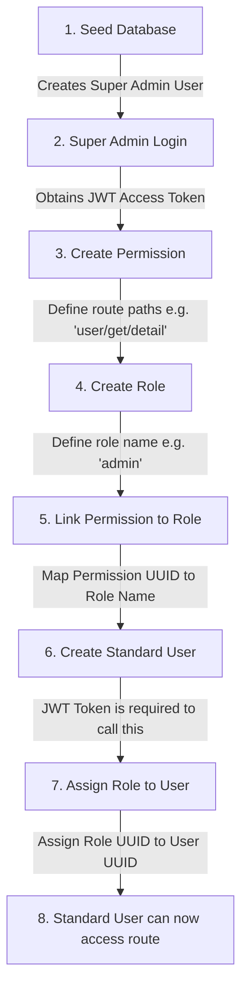

# 🚀 NestJS Role-Based Access Control (RBAC) API

A NestJS (v11) API for User, Role, and Permission Management with dynamic route authorization checking, backed by PostgreSQL and TypeORM.

---

## 🛠️ Tech Stack
*   **Framework:** NestJS (v11)
*   **Language:** TypeScript
*   **Database:** PostgreSQL
*   **ORM:** TypeORM
*   **Security:** JWT (Authentication) & Bcrypt (Password Hashing)

---

## 🗄️ Database Schema & Relationships

The database is built on **PostgreSQL** using **TypeORM** schemas with automatic timestamping. It consists of the following tables:

### 1. User Table (`user`)
Stores user profiles and login credentials.
*   **`id`** (UUID, Primary Key)
*   **`email`** (VARCHAR, Unique): Used for user login.
*   **`pass`** (VARCHAR): Hashed user password.
*   **`slug`** (VARCHAR): Auto-generated lowercase slug from email.
*   **`roleId`** (UUID, Foreign Key): Links to the `role` table (Many-to-One).

### 2. Role Table (`role`)
Stores roles / permission groups.
*   **`id`** (UUID, Primary Key)
*   **`name`** (VARCHAR): Name of the role (e.g. `SUPERADMIN`, `admin`).
*   **`status`** (BOOLEAN): Active status of the role.
*   **`slug`** (VARCHAR): Auto-generated slug from role name.

### 3. Permission Table (`Permission`)
Stores registered API route permission tags.
*   **`id`** (UUID, Primary Key)
*   **`permission`** (VARCHAR): Plain route path string (e.g. `user/get/detail`).
*   **`slug`** (VARCHAR): Auto-generated slug from the path (e.g. `user_get_detail`).

### 4. Relations
*   **User ➔ Role (Many-to-One):** Each user can have one assigned role. A role can be assigned to multiple users.
*   **Role ➔ Permission (Many-to-Many):** Managed via the auto-generated join table `role_permissions_permission`. A role can hold multiple permissions, and a permission can belong to multiple roles.

---

## ⚙️ Setup & Configuration

### 1. Environment Config (`.env`)
Create a `.env` file in the root directory:
```env
PORT=3000
DB_HOST=localhost
DB_PORT=5432
DB_USER=postgres
DB_PASS=your_password
DB_NAME=fullapp
DB_SYNC=true
```

### 2. Installation
```bash
npm install
```

### 3. Start Database & App
Create a PostgreSQL database named `fullapp`, then run the server:
```bash
npm run start:dev
```

---

## 👑 Super Admin Workflow Chart
This is the sequential flowchart showing how the Super Admin initializes the application, creates roles/permissions, creates a user, and assigns the role.



---

## 📝 Sequence of Execution (Step-by-Step)

Here is the exact order in which actions must occur:

1.  **Seed Super Admin:** Generate the initial admin account (`superadmin@example.com` / `admin@123`) using the script:
    ```bash
    npx ts-node src/user/seedrun.ts
    ```
2.  **Login as Super Admin:** Authenticate using the seed credentials to get your Bearer JWT token.
3.  **Register a Permission:** Create the route path permission in the database (e.g., `user/get/detail`).
4.  **Register a Role:** Create a target role (e.g., `admin`).
5.  **Map Permission to Role:** Attach the registered permission to the role using the permission UUID.
6.  **Create a Standard User:** Register a new user account. This endpoint requires the Super Admin's JWT token in the request header.
7.  **Assign Role to User:** Associate the target role with the standard user.
8.  **Access Protected Endpoint:** The standard user logs in, receives their own JWT token, and successfully fetches their detail page.

---

## 📌 Postman API Reference (Requests & Responses)

Use the payloads below to test the workflow in Postman.

### 1. Super Admin Login
*   **Method:** `POST`
*   **URL:** `http://localhost:3000/user/log`
*   **Body:**
    ```json
    {
      "email": "superadmin@example.com",
      "pass": "admin@123"
    }
    ```
*   **Response (Success):**
    ```json
    {
      "mesaage": "successful login",
      "admin": "superadmin@example.com",
      "accesstoken": "eyJhbGciOiJIUzI1NiIsInR5cCI6IkpXVCJ9..."
    }
    ```

---

### 2. Create Permission
*   **Method:** `POST`
*   **URL:** `http://localhost:3000/permission`
*   **Body:**
    ```json
    {
      "permission": "user/get/detail"
    }
    ```
*   **Response (Success):**
    ```json
    {
      "permission": "user/get/detail",
      "slug": "user_get_detail",
      "id": "90e1f74a-efb3-469b-98df-89241bde515e",
      "createat": "2026-06-03T12:05:00.000Z",
      "updateat": "2026-06-03T12:05:00.000Z",
      "deleteat": null
    }
    ```

---

### 3. Create Role
*   **Method:** `POST`
*   **URL:** `http://localhost:3000/role/addrole`
*   **Body:**
    ```json
    {
      "name": "admin",
      "status": true
    }
    ```
*   **Response (Success):**
    ```json
    {
      "name": "admin",
      "status": true,
      "slug": "admin",
      "id": "7df4c74a-1049-4b68-809f-e3c6314f85e4",
      "createat": "2026-06-03T12:10:00.000Z",
      "updateat": "2026-06-03T12:10:00.000Z",
      "deleteat": null
    }
    ```

---

### 4. Link Permission to Role
*   **Method:** `POST`
*   **URL:** `http://localhost:3000/role/admin` (Replace `/admin` with your role name)
*   **Body:**
    ```json
    {
      "permissionIds": ["90e1f74a-efb3-469b-98df-89241bde515e"]
    }
    ```
*   **Response (Success):**
    ```json
    {
      "message": "Permissions added to role successfully",
      "role": {
        "id": "7df4c74a-1049-4b68-809f-e3c6314f85e4",
        "name": "admin",
        "permissions": [
          {
            "id": "90e1f74a-efb3-469b-98df-89241bde515e",
            "permission": "user/get/detail",
            "slug": "user_get_detail"
          }
        ]
      }
    }
    ```

---

### 5. Create a Standard User (Authenticated)
*   **Method:** `POST`
*   **URL:** `http://localhost:3000/user/add`
*   **Headers:** `Authorization: Bearer <SUPERADMIN_JWT_TOKEN>`
*   **Body:**
    ```json
    {
      "email": "demo@example.com",
      "pass": "123456"
    }
    ```
*   **Response (Success):**
    ```json
    {
      "email": "demo@example.com",
      "pass": "$2b$10$UvIuB88fU/8pP3gV9qS3AunP6wY3Z3lG/l1oR1T...",
      "slug": "demo-example-com",
      "id": "e8d69f00-3fb1-4340-ba76-8025c898b965",
      "createat": "2026-06-03T12:00:00.000Z",
      "updateat": "2026-06-03T12:00:00.000Z",
      "deleteat": null
    }
    ```

---

### 6. Assign Role to User
*   **Method:** `PUT`
*   **URL:** `http://localhost:3000/user/addrole/e8d69f00-3fb1-4340-ba76-8025c898b965` (Replace last parameter with User UUID)
*   **Body:**
    ```json
    {
      "roleid": "7df4c74a-1049-4b68-809f-e3c6314f85e4"
    }
    ```
*   **Response (Success):**
    ```json
    {
      "message": "User update successfully",
      "updateduser": {
        "userId": "e8d69f00-3fb1-4340-ba76-8025c898b965",
        "role": {
          "id": "7df4c74a-1049-4b68-809f-e3c6314f85e4",
          "name": "admin"
        },
        "createat": "2026-06-03T12:00:00.000Z",
        "updateat": "2026-06-03T12:15:00.000Z"
      }
    }
    ```

---

### 7. Access Protected User Detail
*   **Method:** `GET`
*   **URL:** `http://localhost:3000/user/get/detail`
*   **Headers:** `Authorization: Bearer <STANDARD_USER_JWT_TOKEN>`
*   **Response (Success):**
    ```json
    {
      "id": "e8d69f00-3fb1-4340-ba76-8025c898b965",
      "email": "demo@example.com",
      "role": {
        "id": "7df4c74a-1049-4b68-809f-e3c6314f85e4",
        "name": "admin",
        "permissions": [
          {
            "id": "90e1f74a-efb3-469b-98df-89241bde515e",
            "permission": "user/get/detail",
            "slug": "user_get_detail"
          }
        ]
      }
    }
    ```
*   **Response (If Role or Permission is Missing - 403 Forbidden):**
    ```json
    {
      "statusCode": 403,
      "message": "Permission denied",
      "error": "Forbidden"
    }
    ```
